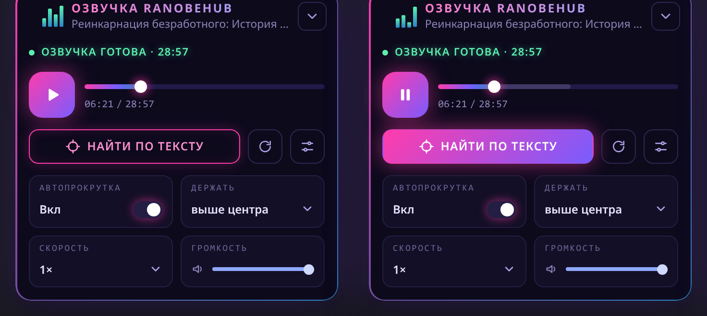

# Озвучка RanobeHub

Расширение для Chrome: на странице главы [RanobeHub](https://ranobehub.org) появляется плеер, который проигрывает готовую озвучку, подсвечивает звучащий абзац и сам прокручивает текст вслед за звуком.



> **Неофициальный проект.** Расширение не связано с RanobeHub и не изменяет сайт — оно только добавляет плеер поверх страницы.

## Возможности

- плеер с перемоткой, скоростью (0.75×–2×) и громкостью;
- подсветка звучащего абзаца и автопрокрутка (можно выбрать, где держать абзац: вверху, выше центра или по центру);
- «Найти по тексту» — кликните по абзацу, и озвучка начнётся с него;
- автопереход к следующей главе;
- если у тайтла или главы нет озвучки, плеер прячется и остаётся маленький значок у края страницы;
- панель можно перетащить в любое место — положение запоминается.

## Установка

Из Chrome Web Store расширения пока нет, поэтому ставится вручную:

1. Скачайте архив из раздела [Releases](../../releases) (или нажмите **Code → Download ZIP**) и распакуйте его.
2. Откройте `chrome://extensions` и включите **Режим разработчика**.
3. Нажмите **Загрузить распакованное** и выберите папку с расширением (ту, где лежит `manifest.json`).
4. Откройте любую главу на ranobehub.org.

Нужен Chrome 116 или новее (подойдут и другие браузеры на Chromium).

**Обновление.** Заменили файлы — нажмите на `chrome://extensions` кнопку обновления (↻) у расширения, **а затем** перезагрузите вкладку с сайтом. Без первого шага Chrome продолжит использовать старые скрипты.

## Приватность

- Разрешение `storage` — только чтобы запоминать настройки и положение панели.
- Доступ к сайтам нужен только к `ranobehub.org` (читать текст главы) и к `huggingface.co` с его CDN (брать готовую озвучку из публичного датасета).
- Расширение не собирает статистику и ничего не отправляет автору.

## Как это устроено

Озвучку (mp3) и файл с разметкой по абзацам создаёт отдельный проект и выкладывает в публичный датасет на Hugging Face. Расширение — только клиент для чтения: оно находит озвучку по `book_id` и `chapter_id` из адреса главы, сопоставляет реплики с абзацами страницы и следит за звуком.

## Разработка

```bash
npm test          # юнит-тесты (Node, без зависимостей)
npm run check     # проверка синтаксиса всех JS-файлов
```

Сборки нет: исходники загружаются как есть. Для ручной проверки используйте «Загрузить распакованное» (см. выше).

## Лицензия

[MIT](LICENSE)
